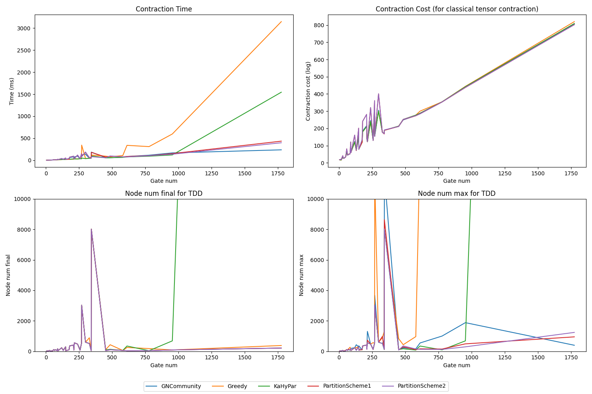

# TDD (CMAKE build)

<div align='left'>
    
</div>

## Overview
Decision diagrams have been used in the simulation and equivalence checking of quantum circuits. Inspired by the efficiency and flexibility of Tensor Networks. 
A tensor network-based decision diagram has been proposed at https://dl.acm.org/doi/10.1145/3514355. 
This repository gives a C++ implementation of the Tensor Decision Diagram(TDD), 
and the package is developed based on the DD package used in mqt-core https://github.com/cda-tum/mqt-core.

The build system is CMake, and the package is tested on Ubuntu 20.04 with g++ 11.4.0. 

To see the original Visual Studio project, please visit https://github.com/Veriqc/TDD_C.


## Build

Dependencies include:

- KaHyPar: https://github.com/kahypar/kahypar
- xtensor: https://github.com/xtensor-stack/xtensor
- xtl: https://github.com/xtensor-stack/xtl

`xtensor` and `xtl` have been included in our build process. You only have to install `KaHyPar` 
and set the path in the `CMakeLists.txt` file.

To build the dependencies, you can use the following commands:

```shell
cd code/deps/kahypar
mkdir build || cd build
cmake .. -DCMAKE_BUILD_TYPE=RELEASE
sudo make install.library
```

Or simply run the `build_dependencies.sh` script in the root directory.


## Benchmark

We have tested five contraction methods on the same set of 39 quantum circuits. The results have
been saved into the `Benchmarks/result` directory.

If you want to run the benchmarks, you can simply run the `run.sh` script in the root directory. 
We recommend running the benchmarks on a machine with at least 16GB of RAM and the operating system 
should better be Linux. We haven't tested the benchmarks on Windows or MacOS.

The visualization of the results is as follows:




